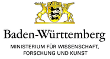

# SARA - Software Archiving of Research Artefacts

## Why SARA?
In many scientific disciplines, software tools play an essential role in the collection, analysis and interpretation of research data. In other disciplines the software itself is the research product. Without the data and the software the research process can neither be completely reproduced nor serve as a basis for further research. It should therefore be kept and made available for the long-term. 

## What does SARA do?
The SARA project (Software Archiving of Research Artefacts) developed a web service that extracts files and metadata from git repositories and pushes them into an archive for long-term availability and institutional repository for publication. The web service has many helpful features, e.g. the easy inclusion of the development history (in whole or in part) for long term availability, the selection of certain branches only, etc. Published research artefacts receive a persistent identifier (e.g. DOI, URN) for citation and credit.

## Compatibility
At the moment SARA supports the repository software DSpace, which is widely used for institutional repositories by research organisations. If you are interested in adding compatibility for other repository software, please contact us.

## Project website & contact
For more information, visit https://sara-service.org or contact us at info@sara-service.org!

## About SARA

SARA was developed by the [Distributed Systems Working Group](https://www.disy.uni-konstanz.de/), [University of Konstanz](https://www.uni-konstanz.de/), and the [Communication and Information Centre (kiz)](https://www.uni-ulm.de/einrichtungen/kiz/) and the [Institute of Information Resource Management](https://www.uni-ulm.de/in/omi/), [Ulm University](https://www.uni-ulm.de/).

 

Sponsored by the [Ministerium für Wissenschaft, Forschung und Kunst Baden-Württemberg](https://mwk.baden-wuerttemberg.de/).

