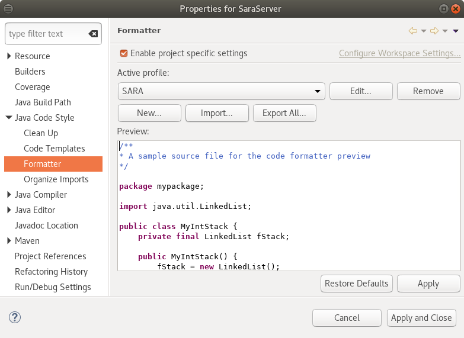
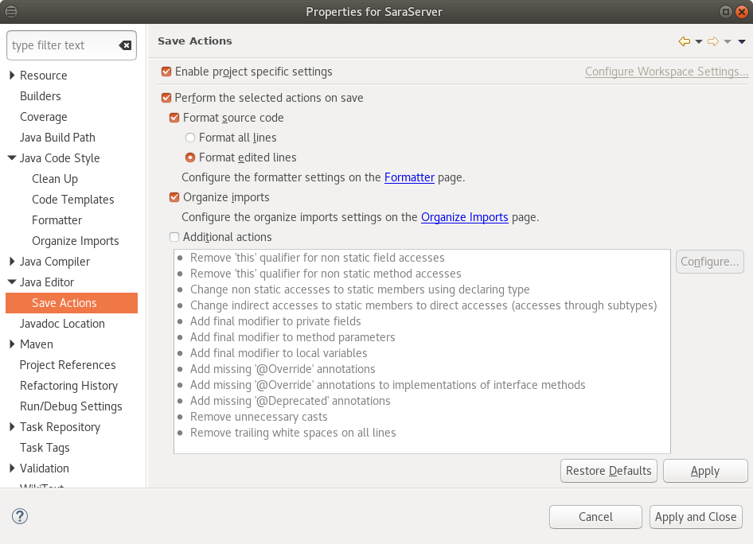

# Eclipse IDE Setup

reference Eclipse Version: *Oxygen.1a Release (4.7.1a)* (Build id: 20171005-1200)

in the *Project* → *Properties* dialog under *Java Code Style* → *Formatter*, *Enable project specific settings*, import `SARA-formatter.xml` and select the *SARA* profile.

in the same *Project* → *Properties* dialog under *Java Editor* → *Save Actions*, *Enable project specific settings* and
- enable *Perform the selected actions on save*
- enable *Format souce code* → *Format edited lines* (for now)
- enable *Organize imports*
- disable *Additional actions* (for now)

for *Organize Imports*, the defaults should be fine.
